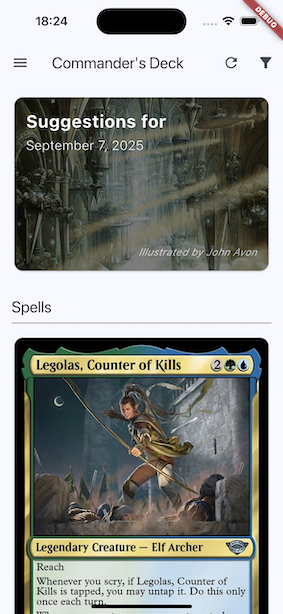
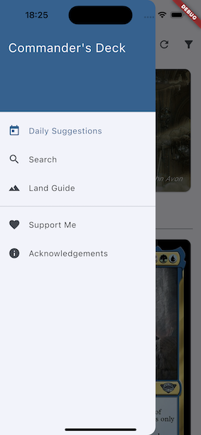
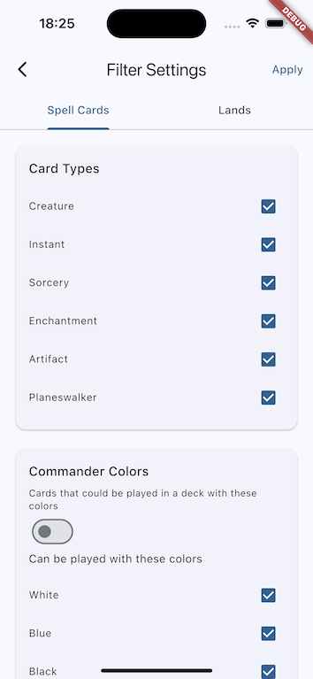
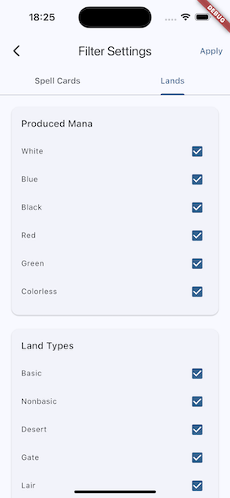

// README.md
# Commander Daily Cards

A Flutter app that provides daily card suggestions for Magic: The Gathering Commander decks using the Scryfall API.

## Features

- **Daily Card Suggestions**: Get regular cards and game changer cards suggestion every day
- **Land & Spell Separation**: Separate suggestions for lands and spells
- **Scryfall Integration**: Downloads and updates card data from Scryfall API every two weeks
- **Commander Ban List**: Automatically filters out banned cards
- **Advanced Filtering**: 
  - Spells: Filter by card types, colors, mana cost, and keywords
  - Lands: Filter by land types, produced mana, and special lands
- **Offline Support**: Stores card data locally for offline access
- **Deterministic Selection**: Same daily cards for all users on the same day
- **Artist Credits**: Shows artist information for card artwork
- **Support & Info**: Added support and acknowledgement sections

## Screens
**Home screen**



**Menu**



**Home screen spell filter**



**Home screen land filter**




## Getting Started

### Prerequisites

- Flutter SDK (>=3.0.0)
- Dart SDK (>=3.0.0)
- Android Studio or VS Code with Flutter extension

### Installation

1. Clone this repository
2. Run `flutter pub get` to install dependencies
3. Run `flutter run` to start the app

### Dependencies

- `http`: For API calls to Scryfall
- `shared_preferences`: For local data persistence
- `cached_network_image`: For efficient image loading and caching
- `provider`: For state management
- `intl`: For date formatting

## Project Structure

```
lib/
├── main.dart                # App entry point
├── models/
│   ├── mtg_card.dart       # MTG card data model
│   ├── bulk_data.dart      # Scryfall bulk data models
│   ├── card_enums.dart     # Card types and color enums
│   └── filters/
│       ├── base_filter_settings.dart
│       ├── spell_filter_settings.dart
│       └── land_filter_settings.dart
├── services/
│   └── card_service.dart   # Main service for card data management
├── screens/
│   ├── home/              # Main screen with daily cards
│   └── filter/            # Filter configuration screens
└── widgets/
    ├── app_drawer.dart    # Navigation drawer
    ├── app_bar.dart       # Custom app bar
    └── card_suggestion_section.dart
```

## How It Works

1. **Data Download**: On first launch, downloads all Commander-legal cards from Scryfall's bulk data API
2. **Local Storage**: Stores card data locally using SharedPreferences (JSON format)
3. **Auto Updates**: Checks for new card data every 2 weeks and updates automatically
4. **Daily Selection**: Uses date-based seeding to ensure deterministic daily card selection
5. **Filtering**: Applies user preferences to filter available cards
6. **Ban List**: Maintains an up-to-date Commander ban list to exclude banned cards

## API Usage

The app uses the Scryfall API responsibly:
- Downloads bulk data instead of making individual card requests
- Updates data only every 2 weeks to minimize API calls
- Caches all data locally for offline use
- Respects Scryfall's rate limits and guidelines

## Customization

### Adding New Filter Options
1. Add new properties to `FilterSettings` class
2. Update the `matchesCard` method to include new filters
3. Add UI elements in `FilterScreen`

### Updating Ban List
Update the `_isCommanderBanned` method in `CardService` with the latest banned cards.

### Modifying Game Changer Logic
Adjust the `_isGameChanger` method in `CardService` to change criteria for game-changing cards.

## Building for Release

### Android
```bash
flutter build apk --release
```

### iOS
```bash
flutter build ios --release
```

## Contributing

1. Fork the repository
2. Create a feature branch
3. Make your changes
4. Add tests if applicable
5. Submit a pull request

## License

This project is licensed under the AGPL-3.0 License - see the LICENSE.md file for details.

## Acknowledgments

- Scryfall for providing the comprehensive MTG card API
- The Flutter team for the excellent framework
- The MTG community for feedback and suggestions