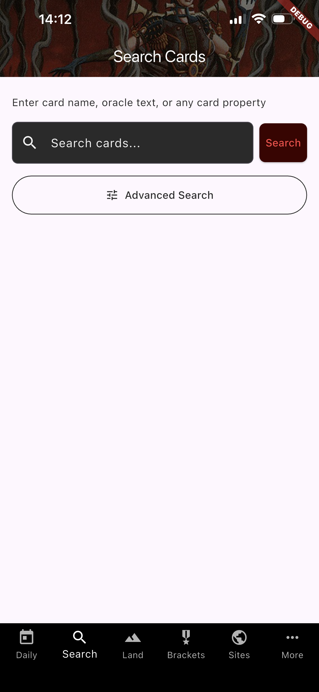
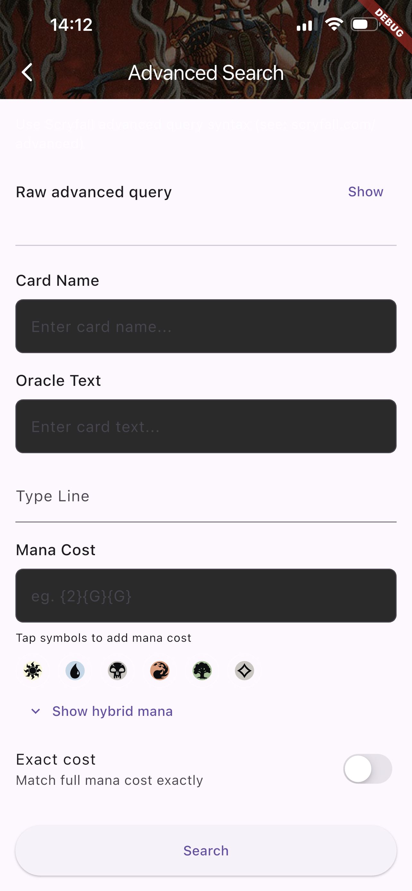
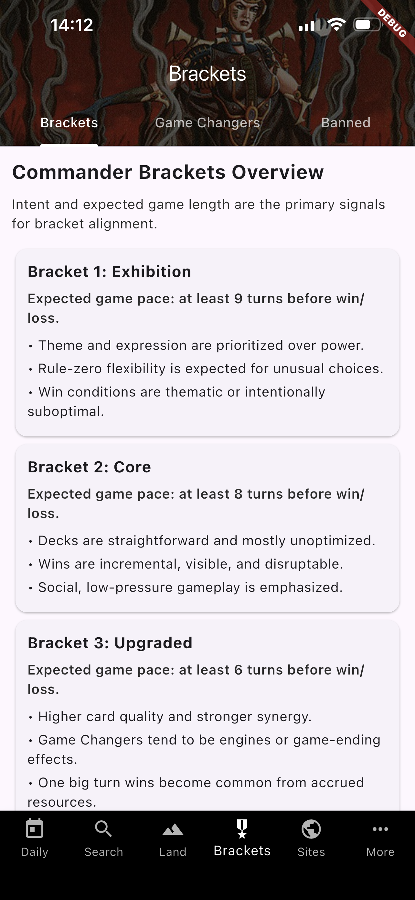
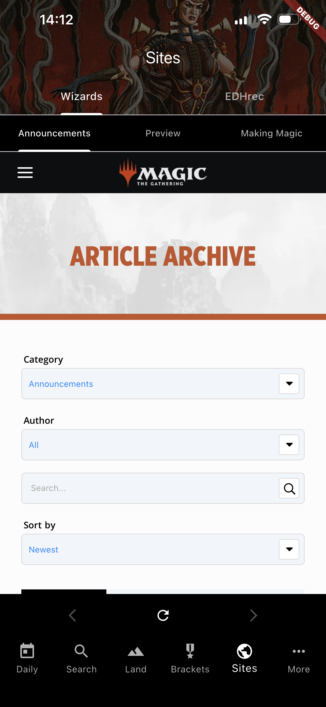

# Command

Command is a Flutter app for Magic: The Gathering Commander players who want faster deck-building decisions without bouncing between tools.

It brings together daily card recommendations, commander-aware filtering, local search, curated format views, and in-app browsing for key Commander resources. The app is built on Scryfall bulk data, works primarily from a local cache, and keeps daily suggestions deterministic so the experience feels stable and intentional.

## Overview

- Daily Commander-focused card suggestions for spells and lands
- Commander picker that updates the Daily screen to the selected color identity
- Fast local search plus advanced Scryfall-style query support
- Dedicated screens for brackets, banned cards, and game changers
- In-app browsing for Wizards and EDHREC with navigation controls and domain restrictions
- Offline-friendly data model powered by local caching

## Why It Exists

Commander deck building usually means moving between card databases, articles, and personal notes. Command narrows that workflow into a single app:

- discover a fresh set of daily recommendations
- anchor them to a commander you actually want to build around
- search the full local card pool instantly
- review bracket, banned, and game changer context without leaving the app

## Feature Highlights

### Daily Suggestions

- Daily spell and land recommendations generated from local card data
- Separate slots for regular and game changer picks
- Pull-to-refresh support using the current filter state
- Swipeable app bar artwork sourced from the active daily pool
- Commander selection flow that immediately applies the commander's color identity to daily filtering

### Commander-First Workflow

- Commander-only autocomplete search on the Daily screen
- Results limited to cards that can legally function as commanders
- Selected commander is shown inline on the Daily page
- Tapping the selected commander reopens search so a new commander can be chosen quickly

### Search

- Local search by name, oracle text, and card properties
- Advanced search screen with Scryfall-style query syntax
- Fullscreen card zoom experience
- Card detail and art actions for deeper inspection

### Format Utility Screens

- Brackets screen for curated browsing
- Game Changers screen
- Banned cards screen
- Double-faced card badges and other visual cues throughout the app

### Sites

- Wizards section with dedicated tabs for Announcements, Preview, and Making Magic
- EDHREC tab for in-app browsing
- Back, forward, and refresh controls
- Navigation locked to approved domains so each tab stays focused on its intended source

### Data Model

- Built on Scryfall bulk data instead of one-card-at-a-time requests
- Cached locally for faster repeat use
- Designed so search and filtering stay local after the dataset is available
- Daily results are deterministic for the current date and filter state

## Screenshots

### Daily


### Search



### Advanced Search



### Brackets



### Game Changers


### Banned


### Sites



## Built With

- Flutter
- Dart
- Provider
- Scryfall bulk data
- Shared preferences and local file storage
- WebView for embedded site browsing

## Key Packages

- `provider`
- `http`
- `shared_preferences`
- `path_provider`
- `cached_network_image`
- `intl`
- `url_launcher`
- `image_gallery_saver`
- `flutter_svg`
- `webview_flutter`

## Getting Started

### Requirements

- Flutter SDK
- Dart SDK
- Xcode for iOS and macOS builds
- Android SDK for Android builds

### Install Dependencies

```bash
flutter pub get
```

### Run the App

```bash
flutter run
```

## Project Structure

```text
lib/
├── main.dart
├── models/
│   ├── cards/
│   ├── filters/
│   └── service/
├── screens/
│   ├── acknowledgements/
│   ├── brackets/
│   ├── card_search/
│   ├── home/
│   ├── land_guide/
│   ├── more/
│   ├── navigation/
│   ├── sites/
│   └── support/
├── services/
├── styles/
├── utils/
└── widgets/
```

## How Daily Recommendations Work

1. Card data is loaded from the local cache or refreshed from Scryfall bulk data.
2. Spell and land filters are applied locally.
3. A date-based deterministic seed builds the daily recommendation set.
4. The app keeps those results stable until the filters or date change.
5. Selecting a commander updates the active color identity and regenerates the daily page accordingly.

## Notes

- The app is designed around Commander legality.
- Banned cards are excluded from daily recommendations.
- Search is local after the bulk dataset is available.
- The Sites screen intentionally blocks navigation outside the approved Wizards and EDHREC domains.

## License

This project is licensed under the AGPL-3.0 License. See [license.md](license.md).

## Credits

- Scryfall for card data
- Flutter for the framework
- The Commander community for the format inspiration