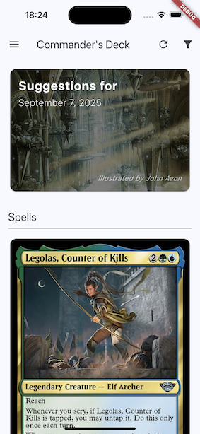
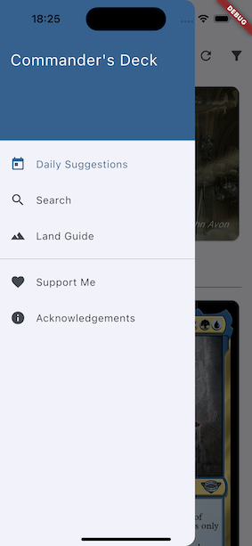
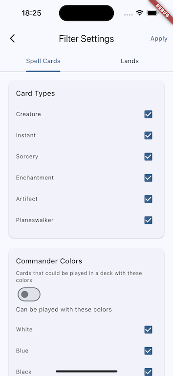
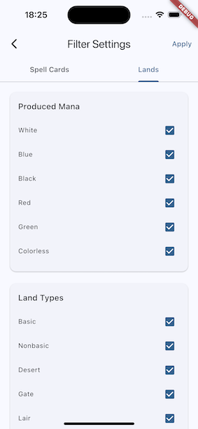

// README.md
# Commander's Deck

A Flutter app that provides daily card suggestions for Magic: The Gathering Commander decks using the Scryfall API.

## Features

- **Daily Card Suggestions**: Get regular cards and game changer cards suggested every day
- **Land & Spell Separation**: Separate suggestions for lands and spells
- **Card Search**: Search cards by name, oracle text, type, and more (supports Scryfall advanced query syntax)
- **Zoom & Save Art**: View card art fullscreen, copy card details, and save art to device gallery
- **Scryfall Integration**: Downloads and updates card data from Scryfall API every two weeks (bulk download)
- **Commander Ban List**: Automatically filters out banned cards
- **Advanced Filtering**:
  - Spells: Filter by card types, colors, mana cost, keywords, and other properties
  - Lands: Filter by land types, produced mana, and special land abilities
- **Offline Support**: Stores card data locally for offline access
- **Deterministic Selection**: Same daily cards for all users on the same day
- **Support & Acknowledgements**: Built-in support screen with links and acknowledgements section

## Screens
**Home screen**



**Menu**



**Home screen spell filter**



**Home screen land filter**




## Getting Started

### Prerequisites

- Flutter SDK (>=3.0.0)
- Dart SDK (>=3.0.0)
- Android Studio or VS Code with Flutter extension

### Installation

1. Clone this repository
2. Run `flutter pub get` to install dependencies
3. Run `flutter run` to start the app

### Dependencies

- `http`: For API calls to Scryfall
- `shared_preferences`: For local data persistence
- `path_provider`: For local file storage
- `cached_network_image`: For efficient image loading and caching
- `provider`: For state management
- `intl`: For date formatting
- `url_launcher`: For opening support links
- `image_gallery_saver`: For saving card art to the device gallery

## Project Structure

```
lib/
├── main.dart
├── models/
│   ├── cards/               # MTG card model and enums
│   │   ├── card_enums.dart
│   │   └── mtg_card.dart
│   ├── filters/             # Filter settings and logic
│   │   ├── base_filter_settings.dart
│   │   ├── filter_settings.dart
│   │   ├── land_filter_settings.dart
│   │   └── spell_filter_settings.dart
│   └── service/             # Scryfall bulk data models
│       └── bulk_data.dart
├── services/
│   └── card_service.dart    # Main service for card data and daily selection
├── screens/
│   ├── acknowledgements/
│   ├── card_search/         # Search + advanced search screens
│   ├── home/                # Daily card suggestions
│   ├── land_guide/          # Land guide (coming soon)
│   ├── navigation/          # App navigation wrapper
│   └── support/             # Support screen with links
└── widgets/
    ├── app_bar.dart
    ├── app_drawer.dart
    ├── card_suggestion_section.dart
    ├── card_widget.dart
    └── card_zoom_view.dart
```

## How It Works

1. **Data Download**: On first launch, downloads all Commander-legal cards from Scryfall's bulk data API
2. **Local Storage**: Stores card data locally using SharedPreferences (JSON format)
3. **Auto Updates**: Checks for new card data every 2 weeks and updates automatically
4. **Daily Selection**: Uses date-based seeding to ensure deterministic daily card selection
5. **Filtering**: Applies user preferences to filter available cards
6. **Ban List**: Maintains an up-to-date Commander ban list to exclude banned cards

## API Usage

The app uses the Scryfall API responsibly:
- Downloads bulk data instead of making individual card requests
- Updates data only every 2 weeks to minimize API calls
- Caches all data locally for offline use
- Respects Scryfall's rate limits and guidelines

## Customization

### Adding New Filter Options
1. Add new properties to `FilterSettings` class
2. Update the `matchesCard` method to include new filters
3. Add UI elements in `FilterScreen`

### Updating Ban List
Update the `_isCommanderBanned` method in `CardService` with the latest banned cards.

### Modifying Game Changer Logic
Adjust the `_isGameChanger` method in `CardService` to change criteria for game-changing cards.

### Extending Search

- The search screen supports basic text search and Scryfall advanced query syntax.
- The advanced search screen builds queries that are parsed locally—no network call is required once card data is cached.

## Building for Release

### Android
```bash
flutter build apk --release
```

### iOS
```bash
flutter build ios --release
```

## Contributing

1. Fork the repository
2. Create a feature branch
3. Make your changes
4. Add tests if applicable
5. Submit a pull request

## License

This project is licensed under the AGPL-3.0 License - see the LICENSE.md file for details.

## Acknowledgments

- Scryfall for providing the comprehensive MTG card API
- The Flutter team for the excellent framework
- The MTG community for feedback and suggestions